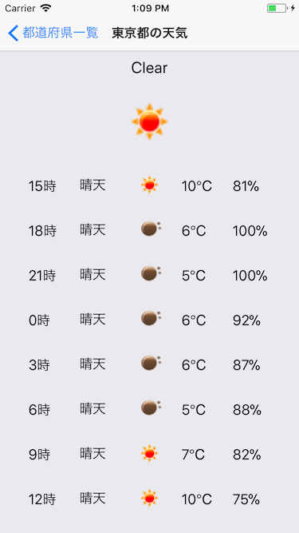

# WeatherForecast
- [Expo](https://expo.io/)を利用して作った天気予報アプリです
- [WEB+DB PRESS Vol.102](http://gihyo.jp/magazine/wdpress/archive/2018/vol102)の記事を参考にさせていただいております
- 記事中のサンプルコードは[こちら](https://github.com/mickamy/WeatherForecast)です



# Requirements
- [Node.js](https://nodejs.org/ja/)
- [Expo](https://expo.io/)
- [OpenWeatherMap](https://openweathermap.org/) のAPI Key => services/WeatherService.jsにセットしてください

# Publishing
- [Expo](https://expo.io/)の[Publishing](https://docs.expo.io/versions/latest/guides/publishing.html) で動作確認ができるアプリを公開しております
- [weatherforecast](https://expo.io/@torifukukaiou/weatherforecast)
- Expo mobile app をインストールしていただいて、QRコードを読み取っていただくと動作確認を行えます
- ワンソースでAndroid, iOS両対応できております!
- android実機はNexus 5(android 6.0.1)のみで動作確認しております
- iOSはシュミレータのみでの動作確認です

## 参考情報 (2017/12/29 14:30 現在)
- 単純にPublishだけすると、QRコードで読み取ったあとにエラーが発生する問題があります
- [Unhandled JS Exception: TypeError: undefined is not an object (evaluating 'this._subscribableSubscriptions.forEach')](https://github.com/facebook/react-native/issues/17348)
- 回避策は、次の2つです
- node_modules/react-native/Libraries/Components/Subscribable.js に[パッチ](https://github.com/facebook/react-native/issues/17348#issuecomment-353892314)をあてる
- uglify-esを3.3.2に指定する
- 私は[yarn](https://yarnpkg.com/ja/) を使っていますが以下のような感じで解決しました
```
$ rm -rfv node_modules
$ yarn add uglify-es@3.2.2
$ yarn install
```
- 先に紹介した[weatherforecast](https://expo.io/@torifukukaiou/weatherforecast)はこの回避策を施したうえで公開しています
